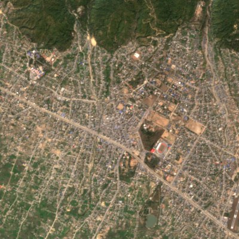

# Karnali Settlement Explorer (web dashboard)

A local web portal for browsing, searching and comparing the 79-settlement screening results
over time. It is backed by a SQLite database built from the repository's research outputs.



## Run it

```bash
mamba env create -f environment.yml -n karnali   # once
mamba activate karnali
python dashboard/build_db.py                       # only after outputs change
python dashboard/app.py                            # open http://127.0.0.1:8050
```

Set `HOST=0.0.0.0` to reach it from other devices on your network. Set `PORT` to change the port.

### Deploy to Vercel

Import the repo in Vercel with the defaults (Framework Preset: **Other**, Root Directory: repo root,
no build command). `vercel.json` routes `/api/*` to the FastAPI app via `api/index.py`, which installs
only `api/requirements.txt`. `dashboard/static/` and `outputs/` are served from Vercel's CDN.
Commit `dashboard/data/karnali_dashboard.sqlite` after rebuilding it.

On Vercel the **Live** layer runs in *on-demand* mode (`dashboard/live_ondemand.py`, standard library
only), because serverless functions cannot run a background updater or write files:

- Rain, river discharge and BIPAD incidents are fetched when requested, cached in the function, and
  cached at Vercel's CDN (`s-maxage=900`).
- Satellite passes come from one STAC search over Karnali. Previews are full-resolution crops
  rendered by the Planetary Computer data API.
- Water in the HAND ≤ 10 m zone is computed by Planetary Computer's `/statistics` endpoint (VV
  histogram for radar, cloud-masked MNDWI for Sentinel-2). Results match the local updater within a
  few percent.

Locally, the mode is `store` whenever `dashboard/data/live.sqlite` exists. Set `LIVE_MODE=ondemand`
or `LIVE_MODE=store` to force either mode.

## What you can do

| View | Use it to |
|---|---|
| **Explorer › list and map** | Search by settlement, municipality, district or river. Filter by district or urban/rural, and sort by exposure. Click a marker or list item to zoom to its 4×4 km window and low-ground zones. Basemaps: light map, OpenStreetMap, or Esri satellite. |
| **Timeline** | Step through the 1972–2026 images every 5 or 10 years. Clicking an image shows a change summary since the previous image shown. |
| **Compare** | Pick any two epochs, or use the 5-year, 10-year or first→latest presets. View them side by side, as a swipe, or as a difference image, with a change summary. |
| **Trends** | GHSL built-up 1975–2020 (whole window vs low ground), plus vegetation and surface-water share per calibrated image. A table view is included. |
| **Low-ground scenarios** | Building counts at HAND ≤ 2, 5 and 10 m, map toggles for each zone, and the scenario figure. |
| **Profile** | The settlement's profile page (`settlements/settlement_profiles/`). |
| **Province overview** | Province totals, a district chart, province built-up growth, and a sortable table of all 79. Click a row to open that settlement. |

Deep links work: `http://127.0.0.1:8050/#KAR-SET-019` opens Birendranagar.

## How change summaries are computed

`GET /api/compare?settlement_id=…&epoch_a=…&epoch_b=…` (see `app.py`, `change_summary`):

- **Built-up (derived):** GHSL R2023A built-up surface, interpolated linearly to each image date.
  - It is computed for the whole window and for the HAND ≤ 10 m zone.
  - Dates outside 1975–2020 are clamped. If both dates fall outside on the same side, no built-up
    change is reported.
- **Vegetation / water / NDVI (derived):** measured on each image's clear pixels.
  - Vegetation is the share with NDVI > 0.3. Water is the share with MNDWI > 0 (green/SWIR1).
  - These are compared only when both images are calibrated surface reflectance (Landsat TM/ETM+/OLI
    L2 or Sentinel-2 L2A). 1970s MSS is visual only.
- **Cautions:** added automatically for different sensors or resolution, different seasons, and
  images that are less than 95% clear.
- **Difference view:** computed in the browser from the two display images (brightness change per
  pixel). It is a visual aid, not a change map.

Nothing in the dashboard is a flood model or a risk-to-life estimate. See `docs/methodology.md` and
`docs/limitations.md`.

## Architecture

```text
dashboard/
├── build_db.py          repo outputs → data/karnali_dashboard.sqlite (derived, read-only index)
├── data/karnali_dashboard.sqlite
├── app.py               FastAPI: /api/* JSON + static files (outputs/, static/)
└── static/              index.html, app.js, style.css (Leaflet, Chart.js, marked from cdnjs)
```

| Table | Contents |
|---|---|
| `settlements` | 79 rows: identity, location, exposure counts, rank, figure and profile paths |
| `images` | one row per settlement × epoch: scene ID, date, sensor, frame path, clear share, indicators |
| `ghsl` | built-up hectares per settlement × GHSL epoch (window and HAND ≤ 10 m zone) |
| `scenarios` | buildings, share and area per HAND level, with the zone GeoJSON |
| `local_levels` | 79 local-level boundaries (simplified) |
| `metadata` | build time, framing, sources |

API docs: `http://127.0.0.1:8050/api/docs`.

## Updating

1. Re-run the screening (`analysis/hazard_exposure/run_karnali_79.py` and `compile_karnali_79.py`).
2. Export the epoch frames: `PYTHONPATH=src python analysis/temporal/export_epoch_frames.py`.
3. Rebuild the database: `python dashboard/build_db.py`.

## Live monitoring (near-real-time)

The **Live monitoring** view and each settlement's **Live now** tab add continuously updated
data on top of the historical record. Live data sits in `dashboard/data/live.sqlite` and
`dashboard/data/live_frames/`. Both are git-ignored and rebuilt by the updater; previews older
than the latest 12 per sensor and settlement are deleted, so disk use stays at roughly 50–100 MB.

```bash
python dashboard/live_update.py            # update everything once
python dashboard/live_update.py --loop     # keep updating on the schedule below
LIVE_UPDATES=1 python dashboard/app.py     # or: web app + updater in one process
```

| Job | Source (free, no key) | Every | What it gives |
|---|---|---|---|
| `weather` | Open-Meteo forecast API (CC BY 4.0) | 60 min | Hourly rain at each settlement: past 3 days (model analysis) and 3-day forecast |
| `discharge` | GloFAS v4 via Open-Meteo flood API (CC BY 4.0) | 3 h | Daily river discharge, past 30 days and 7-day forecast, for the ~5 km cell |
| `incidents` | BIPAD portal API (Government of Nepal) | 60 min | Flood, landslide, heavy-rain, inundation, GLOF and erosion incidents in Karnali (12 months), with losses |
| `satellite` | Planetary Computer: Sentinel-2 L2A and **Sentinel-1 RTC radar** | 6 h | New scenes over each 4×4 km window: preview, clear share, open water inside the HAND ≤ 10 m zone (radar works through cloud) |

Schedules, lookbacks and the radar water threshold are in `configs/monitoring.yaml`. Rain amounts
are labelled with India Meteorological Department 24 h categories, as labels only.

**DHM river gauges** (hydrology.gov.np) are the best real-time source, but their API needs a key.
A slot is reserved (`dhm_gauges.enabled`), so request access from DHM to add observed river
levels.

### Map layers (all free and open, no keys; verified 2026-10-02)

| Group | Layers |
|---|---|
| Street and topographic | Esri light grey, OpenStreetMap, OSM Humanitarian (HOT), CyclOSM, OpenTopoMap (contours), Esri World Topographic, Esri NatGeo, EOX Terrain |
| Satellite basemaps | Esri World Imagery (high-res), EOX Sentinel-2 cloudless 2023 |
| NASA GIBS, near-real-time (date picker) | VIIRS NOAA-20 and NOAA-21 true colour (daily), MODIS Terra true colour (daily), HLS Sentinel-2 and Landsat 30 m |
| NASA GIBS overlays | OPERA surface water from radar (DSWx-S1) and from optical (DSWx-HLS), MODIS 3-day flood, **GPM IMERG rain rate (every 30 min)**, OPERA land-disturbance alerts |
| Other overlays | JRC Global Surface Water occurrence 1984–2021, Esri hillshade, Esri place labels, the 79 local levels |
| Exact scenes | **Full resolution on map** loads any catalogued or live scene as Planetary Computer tiles (no quality loss) |

Google, Bing and other commercial imagery is not used: their terms do not allow it without a
licence.

### Running it continuously

- **Your Mac:** `LIVE_UPDATES=1 python dashboard/app.py` keeps updating while it runs. A macOS
  `launchd` agent can start it at login.
- **Cloud (later):** the same `live_update.py` can run as a scheduled GitHub Action or on a free host
  (see the storage and hosting discussion in the repository history).

**This is not an early-warning system.** Values are model output or automated screening with
unvalidated thresholds. For warnings, follow DHM Nepal and BIPAD / NDRRMA.
