<!-- Generated by analysis/hazard_exposure/build_imagery_index.py; edits will be overwritten. Images are links to outputs/figures/karnali_79/ (not copies). -->

# KAR-SET-051 · Chharka Bhot

**Chharka Tangsong** rural municipality · **Dolpa** District · Karnali Province
· point 83.4154, 29.089887

| Buildings in 4×4 km window | HAND ≤ 2 m | HAND ≤ 5 m | HAND ≤ 10 m | Exposure rank | Images |
|---|---|---|---|---|---|
| 137 | 15 | 27 | 38 | 34 / 79 | 11 / 12 epochs |

[Settlement profile](../../../../../settlements/settlement_profiles/KAR-SET-051_chharka_tangsong.md) ·
[Time-series figure](../../../../figures/karnali_79/imagery_timeseries/KAR-SET-051_chharka_tangsong_timeseries_1972_2026.png) ·
[Low-ground scenario figure](../../../../figures/karnali_79/water_level_scenarios/KAR-SET-051_chharka_tangsong_water_level_scenarios.png) ·
[↑ Rural municipalities of Dolpa](../README.md) ·
[↑ All districts](../../../README.md)

## Satellite images, 1972 → 2026 (one per 5-year epoch)

Click an image to open it at full size. 1972–1982 frames are Landsat MSS false colour (vegetation red).
Frames cover the same 4×4 km window, centred on the settlement point.

<table>
<tr>
<td align="center"><a href="../../../../figures/karnali_79/epoch_frames/KAR-SET-051/1972.jpg">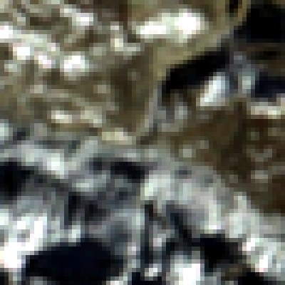</a> <b>1972</b> · 1972-12-16 landsat-1, 60 m</td>
<td align="center"><a href="../../../../figures/karnali_79/epoch_frames/KAR-SET-051/1977.jpg">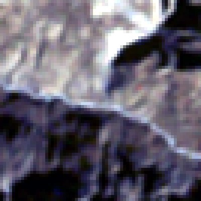</a> <b>1977</b> · 1977-01-09 landsat-2, 60 m</td>
<td align="center" width="180"><b>1982</b> no usable dry-season image in the archive window</td>
<td align="center"><a href="../../../../figures/karnali_79/epoch_frames/KAR-SET-051/1987.jpg">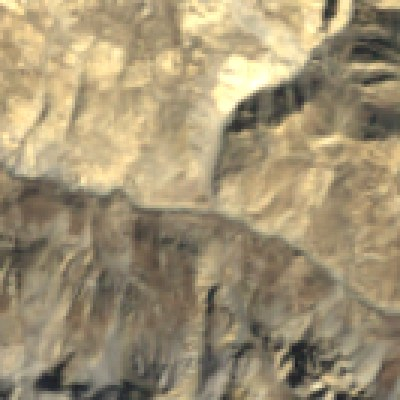</a> <b>1987</b> · 1988-10-19 landsat-5, 30 m</td>
</tr>
<tr>
<td align="center"><a href="../../../../figures/karnali_79/epoch_frames/KAR-SET-051/1992.jpg">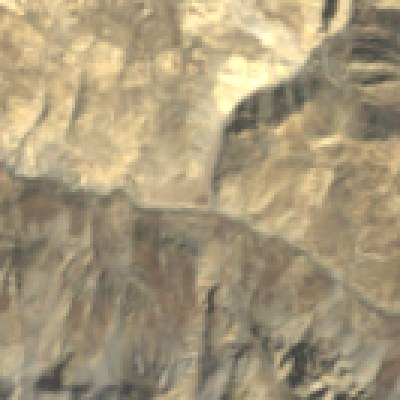</a> <b>1992</b> · 1991-10-12 landsat-5, 30 m</td>
<td align="center"><a href="../../../../figures/karnali_79/epoch_frames/KAR-SET-051/1997.jpg">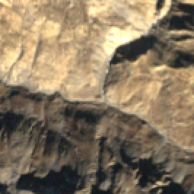</a> <b>1997</b> · 1999-12-04 landsat-7, 30 m</td>
<td align="center"><a href="../../../../figures/karnali_79/epoch_frames/KAR-SET-051/2002.jpg">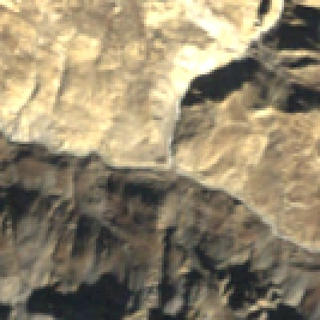</a> <b>2002</b> · 2003-11-30 landsat-5, 30 m</td>
<td align="center"><a href="../../../../figures/karnali_79/epoch_frames/KAR-SET-051/2007.jpg">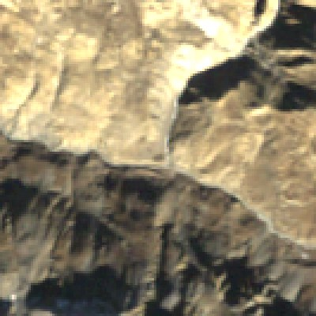</a> <b>2007</b> · 2008-12-13 landsat-5, 30 m</td>
</tr>
<tr>
<td align="center"><a href="../../../../figures/karnali_79/epoch_frames/KAR-SET-051/2012.jpg">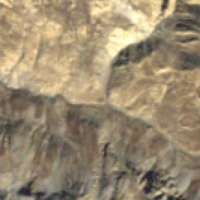</a> <b>2012</b> · 2011-10-19 landsat-5, 30 m</td>
<td align="center"><a href="../../../../figures/karnali_79/epoch_frames/KAR-SET-051/2017.jpg">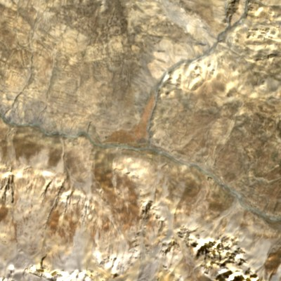</a> <b>2017</b> · 2017-10-01 Sentinel-2A, 10 m</td>
<td align="center"><a href="../../../../figures/karnali_79/epoch_frames/KAR-SET-051/2022.jpg">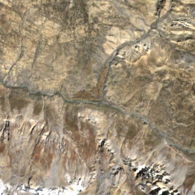</a> <b>2022</b> · 2023-10-05 Sentinel-2B, 10 m</td>
<td align="center"><a href="../../../../figures/karnali_79/epoch_frames/KAR-SET-051/2026.jpg">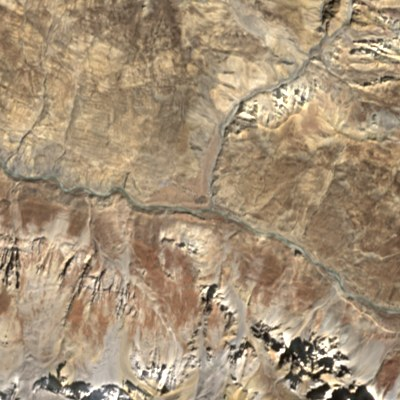</a> <b>2026</b> · 2025-10-24 Sentinel-2B, 10 m</td>
</tr>
</table>

## Time-series figure

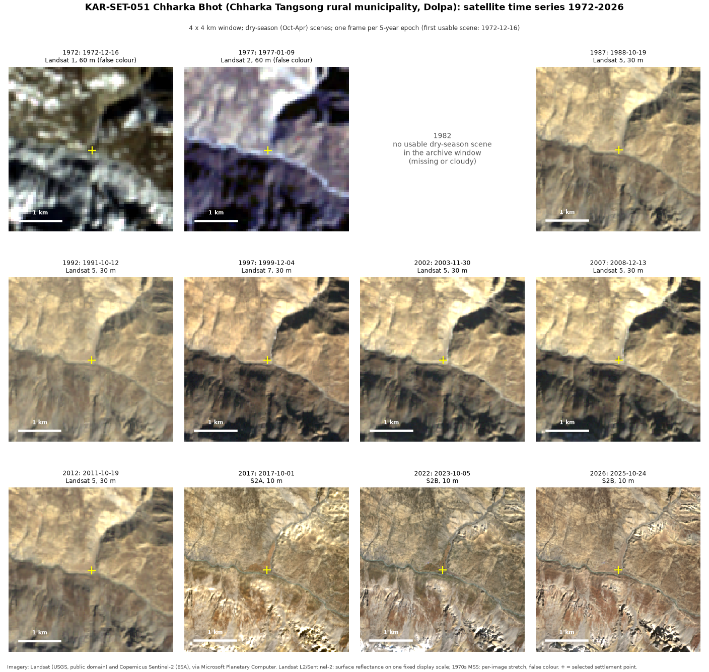

## Low-ground (HAND) scenarios and built-up history

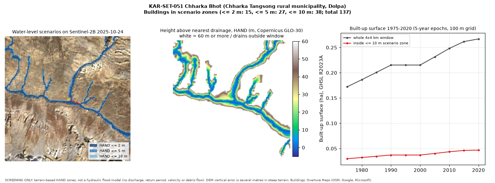

## Image list and indicators

| Epoch | Acquired | Sensor | Res. | Clear | Vegetation | Water | File |
|---|---|---|---|---|---|---|---|
| 1972 | 1972-12-16 | landsat-1 | 60 m | 87% | n/c | n/c | [1972.jpg](../../../../figures/karnali_79/epoch_frames/KAR-SET-051/1972.jpg) |
| 1977 | 1977-01-09 | landsat-2 | 60 m | 100% | n/c | n/c | [1977.jpg](../../../../figures/karnali_79/epoch_frames/KAR-SET-051/1977.jpg) |
| 1987 | 1988-10-19 | landsat-5 | 30 m | 100% | 0.0% | 1.6% | [1987.jpg](../../../../figures/karnali_79/epoch_frames/KAR-SET-051/1987.jpg) |
| 1992 | 1991-10-12 | landsat-5 | 30 m | 100% | 0.0% | 2.8% | [1992.jpg](../../../../figures/karnali_79/epoch_frames/KAR-SET-051/1992.jpg) |
| 1997 | 1999-12-04 | landsat-7 | 30 m | 100% | 0.0% | 8.3% | [1997.jpg](../../../../figures/karnali_79/epoch_frames/KAR-SET-051/1997.jpg) |
| 2002 | 2003-11-30 | landsat-5 | 30 m | 99% | 0.0% | 8.7% | [2002.jpg](../../../../figures/karnali_79/epoch_frames/KAR-SET-051/2002.jpg) |
| 2007 | 2008-12-13 | landsat-5 | 30 m | 97% | 0.0% | 9.8% | [2007.jpg](../../../../figures/karnali_79/epoch_frames/KAR-SET-051/2007.jpg) |
| 2012 | 2011-10-19 | landsat-5 | 30 m | 99% | 0.0% | 1.0% | [2012.jpg](../../../../figures/karnali_79/epoch_frames/KAR-SET-051/2012.jpg) |
| 2017 | 2017-10-01 | Sentinel-2A | 10 m | 98% | 3.9% | 0.3% | [2017.jpg](../../../../figures/karnali_79/epoch_frames/KAR-SET-051/2017.jpg) |
| 2022 | 2023-10-05 | Sentinel-2B | 10 m | 100% | 11.2% | 1.1% | [2022.jpg](../../../../figures/karnali_79/epoch_frames/KAR-SET-051/2022.jpg) |
| 2026 | 2025-10-24 | Sentinel-2B | 10 m | 100% | 0.2% | 0.4% | [2026.jpg](../../../../figures/karnali_79/epoch_frames/KAR-SET-051/2026.jpg) |

n/c = not comparable (uncalibrated 1970s MSS). Exposure screening only, not a risk-to-life estimate;
see [docs/limitations.md](../../../../../docs/limitations.md).
