<!-- Generated by analysis/hazard_exposure/build_imagery_index.py; edits will be overwritten. Images are links to outputs/figures/karnali_79/ (not copies). -->

# KAR-SET-050 · Kola

**Kaike** rural municipality · **Dolpa** District · Karnali Province
· point 83.02931, 28.878161

| Buildings in 4×4 km window | HAND ≤ 2 m | HAND ≤ 5 m | HAND ≤ 10 m | Exposure rank | Images |
|---|---|---|---|---|---|
| 145 | 3 | 4 | 4 | 71 / 79 | 11 / 12 epochs |

[Settlement profile](../../../../../settlements/settlement_profiles/KAR-SET-050_kaike.md) ·
[Time-series figure](../../../../figures/karnali_79/imagery_timeseries/KAR-SET-050_kaike_timeseries_1972_2026.png) ·
[Low-ground scenario figure](../../../../figures/karnali_79/water_level_scenarios/KAR-SET-050_kaike_water_level_scenarios.png) ·
[↑ Rural municipalities of Dolpa](../README.md) ·
[↑ All districts](../../../README.md)

## Satellite images, 1972 → 2026 (one per 5-year epoch)

Click an image to open it at full size. 1972–1982 frames are Landsat MSS false colour (vegetation red).
Frames cover the same 4×4 km window, centred on the settlement point.

<table>
<tr>
<td align="center"><a href="../../../../figures/karnali_79/epoch_frames/KAR-SET-050/1972.jpg">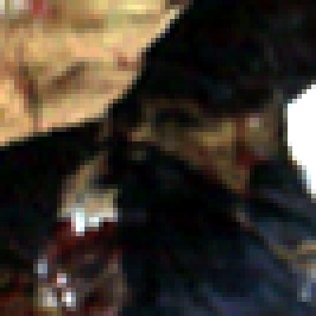</a> <b>1972</b> · 1972-12-16 landsat-1, 60 m</td>
<td align="center"><a href="../../../../figures/karnali_79/epoch_frames/KAR-SET-050/1977.jpg">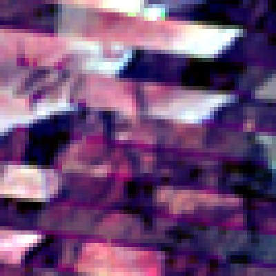</a> <b>1977</b> · 1976-10-11 landsat-2, 60 m</td>
<td align="center" width="180"><b>1982</b> no usable dry-season image in the archive window</td>
<td align="center"><a href="../../../../figures/karnali_79/epoch_frames/KAR-SET-050/1987.jpg">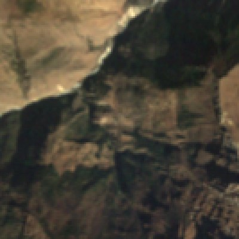</a> <b>1987</b> · 1988-10-26 landsat-5, 30 m</td>
</tr>
<tr>
<td align="center"><a href="../../../../figures/karnali_79/epoch_frames/KAR-SET-050/1992.jpg">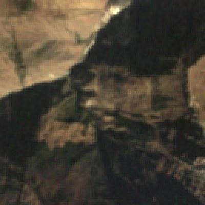</a> <b>1992</b> · 1993-11-09 landsat-5, 30 m</td>
<td align="center"><a href="../../../../figures/karnali_79/epoch_frames/KAR-SET-050/1997.jpg">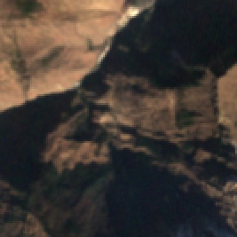</a> <b>1997</b> · 1999-12-04 landsat-7, 30 m</td>
<td align="center"><a href="../../../../figures/karnali_79/epoch_frames/KAR-SET-050/2002.jpg">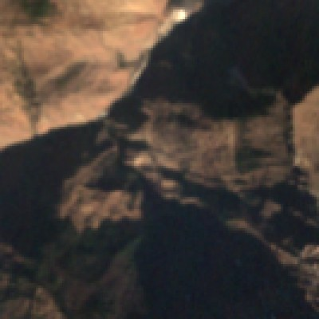</a> <b>2002</b> · 2001-12-09 landsat-7, 30 m</td>
<td align="center"><a href="../../../../figures/karnali_79/epoch_frames/KAR-SET-050/2007.jpg">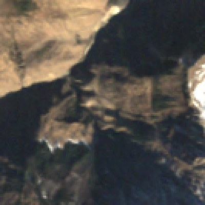</a> <b>2007</b> · 2007-01-25 landsat-5, 30 m</td>
</tr>
<tr>
<td align="center"><a href="../../../../figures/karnali_79/epoch_frames/KAR-SET-050/2012.jpg">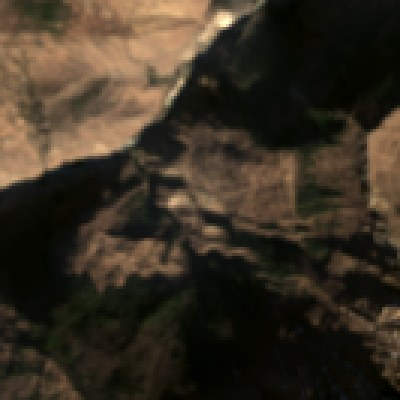</a> <b>2012</b> · 2014-12-05 landsat-8, 30 m</td>
<td align="center"><a href="../../../../figures/karnali_79/epoch_frames/KAR-SET-050/2017.jpg">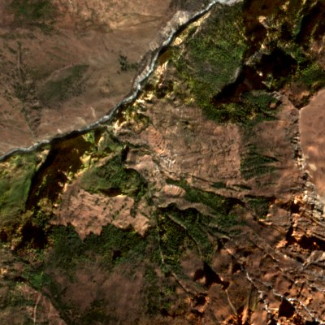</a> <b>2017</b> · 2018-10-31 Sentinel-2B, 10 m</td>
<td align="center"><a href="../../../../figures/karnali_79/epoch_frames/KAR-SET-050/2022.jpg">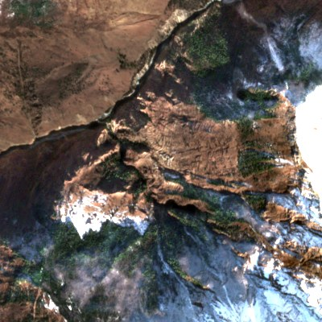</a> <b>2022</b> · 2023-12-14 Sentinel-2B, 10 m</td>
<td align="center"><a href="../../../../figures/karnali_79/epoch_frames/KAR-SET-050/2026.jpg">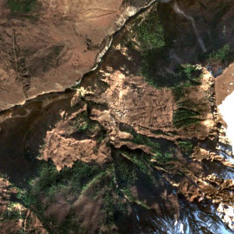</a> <b>2026</b> · 2026-01-17 Sentinel-2C, 10 m</td>
</tr>
</table>

## Time-series figure

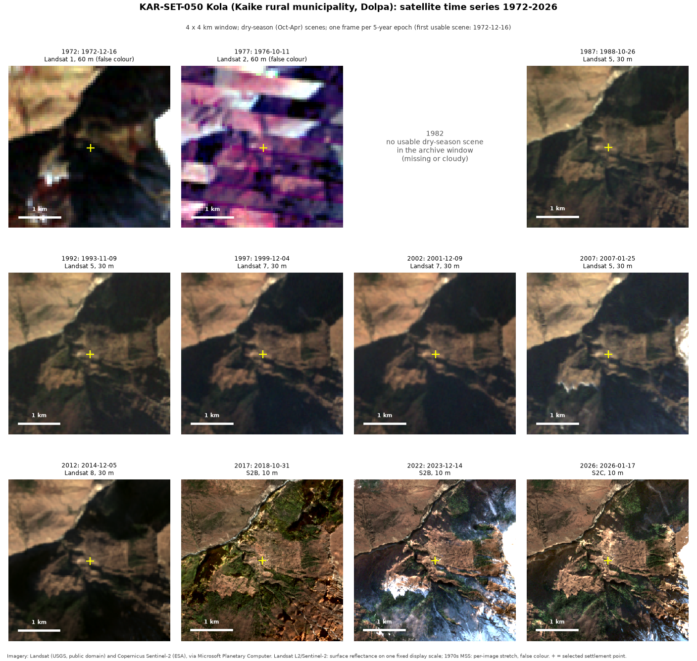

## Low-ground (HAND) scenarios and built-up history

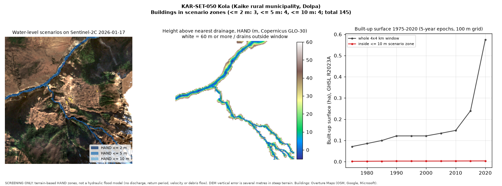

## Image list and indicators

| Epoch | Acquired | Sensor | Res. | Clear | Vegetation | Water | File |
|---|---|---|---|---|---|---|---|
| 1972 | 1972-12-16 | landsat-1 | 60 m | 99% | n/c | n/c | [1972.jpg](../../../../figures/karnali_79/epoch_frames/KAR-SET-050/1972.jpg) |
| 1977 | 1976-10-11 | landsat-2 | 60 m | 100% | n/c | n/c | [1977.jpg](../../../../figures/karnali_79/epoch_frames/KAR-SET-050/1977.jpg) |
| 1987 | 1988-10-26 | landsat-5 | 30 m | 98% | 69.7% | 4.3% | [1987.jpg](../../../../figures/karnali_79/epoch_frames/KAR-SET-050/1987.jpg) |
| 1992 | 1993-11-09 | landsat-5 | 30 m | 97% | 39.8% | 13.0% | [1992.jpg](../../../../figures/karnali_79/epoch_frames/KAR-SET-050/1992.jpg) |
| 1997 | 1999-12-04 | landsat-7 | 30 m | 94% | 33.5% | 14.2% | [1997.jpg](../../../../figures/karnali_79/epoch_frames/KAR-SET-050/1997.jpg) |
| 2002 | 2001-12-09 | landsat-7 | 30 m | 100% | 21.2% | 14.7% | [2002.jpg](../../../../figures/karnali_79/epoch_frames/KAR-SET-050/2002.jpg) |
| 2007 | 2007-01-25 | landsat-5 | 30 m | 99% | 14.5% | 32.1% | [2007.jpg](../../../../figures/karnali_79/epoch_frames/KAR-SET-050/2007.jpg) |
| 2012 | 2014-12-05 | landsat-8 | 30 m | 96% | 73.4% | 0.1% | [2012.jpg](../../../../figures/karnali_79/epoch_frames/KAR-SET-050/2012.jpg) |
| 2017 | 2018-10-31 | Sentinel-2B | 10 m | 100% | 88.7% | 0.1% | [2017.jpg](../../../../figures/karnali_79/epoch_frames/KAR-SET-050/2017.jpg) |
| 2022 | 2023-12-14 | Sentinel-2B | 10 m | 96% | 55.9% | 15.5% | [2022.jpg](../../../../figures/karnali_79/epoch_frames/KAR-SET-050/2022.jpg) |
| 2026 | 2026-01-17 | Sentinel-2C | 10 m | 99% | 62.0% | 1.8% | [2026.jpg](../../../../figures/karnali_79/epoch_frames/KAR-SET-050/2026.jpg) |

n/c = not comparable (uncalibrated 1970s MSS). Exposure screening only, not a risk-to-life estimate;
see [docs/limitations.md](../../../../../docs/limitations.md).
