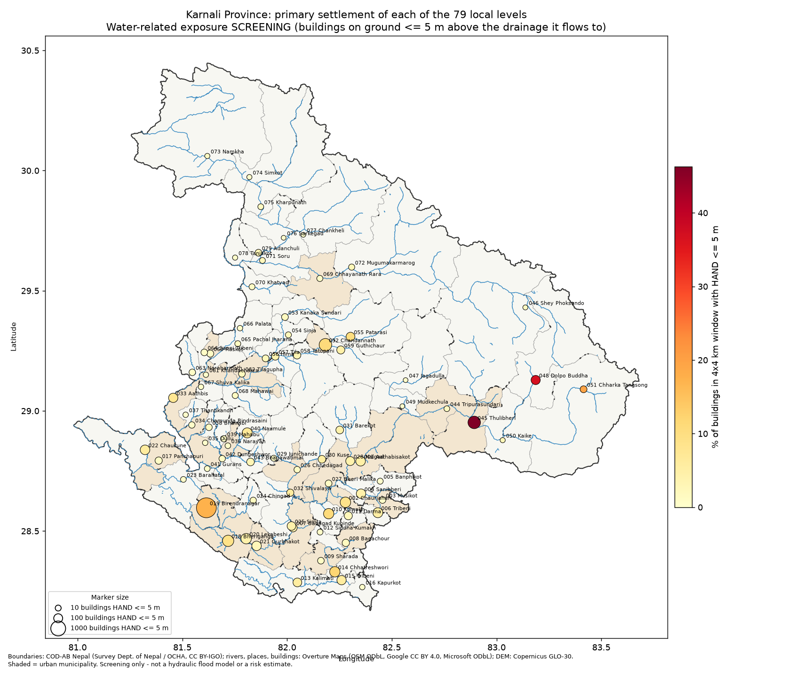

# Karnali Province: water-related exposure screening of 79 local-level settlements

*Generated 2026-10-02 by `analysis/hazard_exposure/compile_karnali_79.py`. Method:
[docs/methodology.md](../../docs/methodology.md). Limitations:
[docs/limitations.md](../../docs/limitations.md). Data sources:
[docs/data_sources.md](../../docs/data_sources.md).*

> **Read this first.** This is an **exposure screening**, not a risk assessment. It shows how many
> buildings stand on ground only a few metres above the stream or river that ground drains to
> (HAND, Height Above Nearest Drainage). It does **not** model flood frequency, depth, speed, debris
> flows or glacial-lake outbursts, and it does **not** count people. No statement about risk to human
> life is made or implied. The ranking says where a proper hazard and risk study would be most
> worthwhile first.

## Scope

- **Units:** all 79 local levels of Karnali Province (25 urban, 54 rural municipalities; COD-AB Nepal).
- **Settlements:** one primary settlement per local level, chosen by building density (65 named
  localities; 14 densest-building-cluster fallbacks). See the
  [inventory](../../settlements/settlement_inventory.csv) and
  [layer](../../data/processed/karnali_79/karnali_79_settlements.geojson).
- **Per settlement:** a 4 x 4 km window with a 12-epoch satellite time series (1972 to 2026, 5-year
  steps), HAND scenario zones at 2 m, 5 m, 10 m, building counts in each zone,
  and GHSL built-up surface 1975–2020.

## Province summary (derived)

- Buildings inside the 79 analysis windows: **159,235**.
- On ground with HAND <= 2 m: **4,116** (2.6%); <= 5 m:
  **8,386** (5.3%); <= 10 m: **14,867**
  (9.3%).
- Image chips catalogued: 869 of 948 possible (79 x 12 epochs). Missing epochs mostly
  reflect archive gaps (especially 1980–84) or persistent cloud or snow.
- Settlements with no mapped river or stream in their 6 x 6 km context: 0 (every settlement has mapped drainage, but unmapped small streams are still missing).

### By type of local level

| local_level_type | settlements | buildings_in_windows | buildings_hand_le_5m |
|---|---|---|---|
| rural municipality | 54 | 73571 | 2354 |
| urban municipality | 25 | 85664 | 6032 |

### By district

| district | settlements | buildings_in_windows | buildings_hand_le_2m | buildings_hand_le_5m | buildings_hand_le_10m |
|---|---|---|---|---|---|
| Dailekh | 11 | 24235 | 189 | 454 | 935 |
| Dolpa | 8 | 3636 | 338 | 642 | 939 |
| Humla | 7 | 5687 | 37 | 51 | 77 |
| Jajarkot | 7 | 10108 | 150 | 293 | 577 |
| Jumla | 8 | 11967 | 452 | 795 | 1404 |
| Kalikot | 9 | 15908 | 93 | 137 | 234 |
| Mugu | 4 | 3975 | 28 | 49 | 73 |
| Rukum West | 6 | 20246 | 323 | 704 | 1263 |
| Salyan | 10 | 19671 | 419 | 848 | 1710 |
| Surkhet | 9 | 43802 | 2087 | 4413 | 7655 |

## Highest exposure: buildings with HAND <= 5 m (top 20)

| Rank | ID | Settlement | Local level | District | Bldgs in window | HAND<=2 m | HAND<=5 m | HAND<=10 m | Share <=5 m | Nearest named watercourse |
|---|---|---|---|---|---|---|---|---|---|---|
| 1 | [KAR-SET-019](../../settlements/settlement_profiles/KAR-SET-019_birendranagar.md) | Birendra Chok | Birendranagar (urban) | Surkhet | 19,949 | 1,679 | 3,465 | 5,730 | 17.4% | Khorke Khola |
| 2 | [KAR-SET-052](../../settlements/settlement_profiles/KAR-SET-052_chandannath.md) | Chandannath | Chandannath (urban) | Jumla | 4,484 | 299 | 489 | 721 | 10.9% | jugad khola |
| 3 | [KAR-SET-045](../../settlements/settlement_profiles/KAR-SET-045_thulibheri.md) | Thuibheri | Thulibheri (urban) | Dolpa | 1,031 | 255 | 477 | 653 | 46.3% | Thuli Bheri |
| 4 | [KAR-SET-018](../../settlements/settlement_profiles/KAR-SET-018_bheriganga.md) | Chhinchu | Bheriganga (urban) | Surkhet | 3,341 | 65 | 306 | 668 | 9.2% | Hattikahal |
| 5 | [KAR-SET-002](../../settlements/settlement_profiles/KAR-SET-002_chaurjahari.md) | Chaupha Bazar | Chaurjahari (urban) | Rukum West | 2,528 | 104 | 220 | 357 | 8.7% | Jahari Khola |
| 6 | [KAR-SET-020](../../settlements/settlement_profiles/KAR-SET-020_lekabeshi.md) | Mathillo Ratmate | Lekabeshi (urban) | Surkhet | 4,706 | 149 | 214 | 301 | 4.5% | Bheri River |
| 7 | [KAR-SET-014](../../settlements/settlement_profiles/KAR-SET-014_chhatreshwori.md) | area near Shankhamool | Chhatreshwori (rural) | Salyan | 1,732 | 72 | 207 | 490 | 12.0% | Sarda Khola |
| 8 | [KAR-SET-010](../../settlements/settlement_profiles/KAR-SET-010_kumakh.md) | Kumakh rural municipality office area | Kumakh (rural) | Salyan | 1,887 | 148 | 205 | 313 | 10.9% | Marma Khola |
| 9 | [KAR-SET-040](../../settlements/settlement_profiles/KAR-SET-040_naumule.md) | area near Naumule | Naumule (rural) | Dailekh | 2,628 | 66 | 182 | 405 | 6.9% | Lohare Nadi |
| 10 | [KAR-SET-006](../../settlements/settlement_profiles/KAR-SET-006_tribeni.md) | Simruth | Tribeni (rural) | Rukum West | 2,999 | 95 | 169 | 228 | 5.6% | Muru Khola |
| 11 | [KAR-SET-022](../../settlements/settlement_profiles/KAR-SET-022_chaukune.md) | Motisera Bajar | Chaukune (rural) | Surkhet | 2,401 | 67 | 145 | 261 | 6.0% | - |
| 12 | [KAR-SET-001](../../settlements/settlement_profiles/KAR-SET-001_aathabisakot.md) | Radi Jyula | Aathabisakot (urban) | Rukum West | 2,854 | 59 | 144 | 384 | 5.0% | भेरी खोला |
| 13 | [KAR-SET-004](../../settlements/settlement_profiles/KAR-SET-004_sanibheri.md) | Simli | Sanibheri (rural) | Rukum West | 3,008 | 41 | 136 | 223 | 4.5% | - |
| 14 | [KAR-SET-021](../../settlements/settlement_profiles/KAR-SET-021_gurbhakot.md) | Mehelkuna Bajar | Gurbhakot (urban) | Surkhet | 4,987 | 59 | 135 | 392 | 2.7% | Bheri River |
| 15 | [KAR-SET-015](../../settlements/settlement_profiles/KAR-SET-015_tribeni.md) | Luham | Tribeni (rural) | Salyan | 2,046 | 52 | 124 | 276 | 6.1% | Sarda Khola |
| 15 | [KAR-SET-033](../../settlements/settlement_profiles/KAR-SET-033_aathbis.md) | Rakam | Aathbis (urban) | Dailekh | 1,634 | 45 | 124 | 268 | 7.6% | कर्णाली |
| 17 | [KAR-SET-048](../../settlements/settlement_profiles/KAR-SET-048_dolpo_buddha.md) | Dho Tarap | Dolpo Buddha (rural) | Dolpa | 321 | 51 | 118 | 222 | 36.8% | Tarap Khola |
| 18 | [KAR-SET-028](../../settlements/settlement_profiles/KAR-SET-028_nalgad.md) | Dalli | Nalgad (urban) | Jajarkot | 2,503 | 37 | 105 | 212 | 4.2% | शाहीकुरी गाड |
| 19 | [KAR-SET-055](../../settlements/settlement_profiles/KAR-SET-055_patarasi.md) | Luma | Patarasi (rural) | Jumla | 929 | 36 | 96 | 246 | 10.3% | Chaudhabise Khola |
| 20 | [KAR-SET-013](../../settlements/settlement_profiles/KAR-SET-013_kalimati.md) | area near Bijeneta | Kalimati (rural) | Salyan | 1,593 | 28 | 94 | 240 | 5.9% | सारदा खोला |

## Highest share of buildings on low ground (windows with >= 200 buildings, top 15)

| ID | Settlement | Local level | Bldgs in window | HAND<=5 m | Share <=5 m |
|---|---|---|---|---|---|
| [KAR-SET-045](../../settlements/settlement_profiles/KAR-SET-045_thulibheri.md) | Thuibheri | Thulibheri | 1031 | 477 | 46.3% |
| [KAR-SET-048](../../settlements/settlement_profiles/KAR-SET-048_dolpo_buddha.md) | Dho Tarap | Dolpo Buddha | 321 | 118 | 36.8% |
| [KAR-SET-019](../../settlements/settlement_profiles/KAR-SET-019_birendranagar.md) | Birendra Chok | Birendranagar | 19949 | 3465 | 17.4% |
| [KAR-SET-014](../../settlements/settlement_profiles/KAR-SET-014_chhatreshwori.md) | area near Shankhamool | Chhatreshwori | 1732 | 207 | 12.0% |
| [KAR-SET-010](../../settlements/settlement_profiles/KAR-SET-010_kumakh.md) | Kumakh rural municipality office area | Kumakh | 1887 | 205 | 10.9% |
| [KAR-SET-052](../../settlements/settlement_profiles/KAR-SET-052_chandannath.md) | Chandannath | Chandannath | 4484 | 489 | 10.9% |
| [KAR-SET-055](../../settlements/settlement_profiles/KAR-SET-055_patarasi.md) | Luma | Patarasi | 929 | 96 | 10.3% |
| [KAR-SET-018](../../settlements/settlement_profiles/KAR-SET-018_bheriganga.md) | Chhinchu | Bheriganga | 3341 | 306 | 9.2% |
| [KAR-SET-002](../../settlements/settlement_profiles/KAR-SET-002_chaurjahari.md) | Chaupha Bazar | Chaurjahari | 2528 | 220 | 8.7% |
| [KAR-SET-033](../../settlements/settlement_profiles/KAR-SET-033_aathbis.md) | Rakam | Aathbis | 1634 | 124 | 7.6% |
| [KAR-SET-040](../../settlements/settlement_profiles/KAR-SET-040_naumule.md) | area near Naumule | Naumule | 2628 | 182 | 6.9% |
| [KAR-SET-032](../../settlements/settlement_profiles/KAR-SET-032_shivalaya.md) | area near Shiwalaya | Shivalaya | 555 | 34 | 6.1% |
| [KAR-SET-015](../../settlements/settlement_profiles/KAR-SET-015_tribeni.md) | Luham | Tribeni | 2046 | 124 | 6.1% |
| [KAR-SET-022](../../settlements/settlement_profiles/KAR-SET-022_chaukune.md) | Motisera Bajar | Chaukune | 2401 | 145 | 6.0% |
| [KAR-SET-013](../../settlements/settlement_profiles/KAR-SET-013_kalimati.md) | area near Bijeneta | Kalimati | 1593 | 94 | 5.9% |

## Built-up growth inside the HAND <= 10 m zone, 1975–2020 (GHSL, top 15)

This answers "has construction moved onto low ground near channels?" GHSL is a ~90 m modelled
product, and its pre-1990 epochs are back-cast, so treat the values as indicative.

| ID | Settlement | Local level | Built-up in zone 1975 (ha) | 2000 (ha) | 2020 (ha) | Change 1975-2020 (ha) |
|---|---|---|---|---|---|---|
| [KAR-SET-019](../../settlements/settlement_profiles/KAR-SET-019_birendranagar.md) | Birendra Chok | Birendranagar | 6.22 | 18.8 | 59.24 | 53.02 |
| [KAR-SET-052](../../settlements/settlement_profiles/KAR-SET-052_chandannath.md) | Chandannath | Chandannath | 0.04 | 1.87 | 8.62 | 8.58 |
| [KAR-SET-018](../../settlements/settlement_profiles/KAR-SET-018_bheriganga.md) | Chhinchu | Bheriganga | 2.26 | 3.64 | 6.37 | 4.11 |
| [KAR-SET-014](../../settlements/settlement_profiles/KAR-SET-014_chhatreshwori.md) | area near Shankhamool | Chhatreshwori | 2.12 | 3.29 | 4.93 | 2.81 |
| [KAR-SET-001](../../settlements/settlement_profiles/KAR-SET-001_aathabisakot.md) | Radi Jyula | Aathabisakot | 0.46 | 0.95 | 3.24 | 2.78 |
| [KAR-SET-022](../../settlements/settlement_profiles/KAR-SET-022_chaukune.md) | Motisera Bajar | Chaukune | 0.22 | 0.6 | 2.95 | 2.73 |
| [KAR-SET-045](../../settlements/settlement_profiles/KAR-SET-045_thulibheri.md) | Thuibheri | Thulibheri | 0.2 | 1.11 | 2.84 | 2.64 |
| [KAR-SET-040](../../settlements/settlement_profiles/KAR-SET-040_naumule.md) | area near Naumule | Naumule | 0.15 | 0.16 | 2.6 | 2.45 |
| [KAR-SET-013](../../settlements/settlement_profiles/KAR-SET-013_kalimati.md) | area near Bijeneta | Kalimati | 1.42 | 1.86 | 3.47 | 2.05 |
| [KAR-SET-028](../../settlements/settlement_profiles/KAR-SET-028_nalgad.md) | Dalli | Nalgad | 1.03 | 1.92 | 2.96 | 1.93 |
| [KAR-SET-002](../../settlements/settlement_profiles/KAR-SET-002_chaurjahari.md) | Chaupha Bazar | Chaurjahari | 1.43 | 1.81 | 3.28 | 1.85 |
| [KAR-SET-015](../../settlements/settlement_profiles/KAR-SET-015_tribeni.md) | Luham | Tribeni | 2.08 | 2.85 | 3.92 | 1.84 |
| [KAR-SET-055](../../settlements/settlement_profiles/KAR-SET-055_patarasi.md) | Luma | Patarasi | 0.17 | 0.26 | 1.95 | 1.78 |
| [KAR-SET-007](../../settlements/settlement_profiles/KAR-SET-007_banagad_kupinde.md) | Devsthal | Banagad Kupinde | 0.69 | 1.19 | 2.39 | 1.7 |
| [KAR-SET-033](../../settlements/settlement_profiles/KAR-SET-033_aathbis.md) | Rakam | Aathbis | 0.21 | 0.39 | 1.87 | 1.66 |

## All 79 settlements

| ID | Settlement | Local level | Type | District | Bldgs | <=2 m | <=5 m | <=10 m | Rank (<=5 m) | First scene | Latest scene | Epochs with image |
|---|---|---|---|---|---|---|---|---|---|---|---|---|
| [KAR-SET-001](../../settlements/settlement_profiles/KAR-SET-001_aathabisakot.md) | Radi Jyula | Aathabisakot | urban | Rukum West | 2854 | 59 | 144 | 384 | 12 | 1972-12-17 | 2026-01-17 | 11/12 |
| [KAR-SET-002](../../settlements/settlement_profiles/KAR-SET-002_chaurjahari.md) | Chaupha Bazar | Chaurjahari | urban | Rukum West | 2528 | 104 | 220 | 357 | 5 | 1972-12-17 | 2026-01-17 | 11/12 |
| [KAR-SET-003](../../settlements/settlement_profiles/KAR-SET-003_musikot.md) | Musikot | Musikot | urban | Rukum West | 5381 | 17 | 23 | 44 | 40 | 1972-12-17 | 2026-01-17 | 11/12 |
| [KAR-SET-004](../../settlements/settlement_profiles/KAR-SET-004_sanibheri.md) | Simli | Sanibheri | rural | Rukum West | 3008 | 41 | 136 | 223 | 13 | 1972-12-17 | 2026-01-17 | 11/12 |
| [KAR-SET-005](../../settlements/settlement_profiles/KAR-SET-005_banphikot.md) | area near Taligaun | Banphikot | rural | Rukum West | 3476 | 7 | 12 | 27 | 53 | 1972-12-17 | 2026-01-17 | 11/12 |
| [KAR-SET-006](../../settlements/settlement_profiles/KAR-SET-006_tribeni.md) | Simruth | Tribeni | rural | Rukum West | 2999 | 95 | 169 | 228 | 10 | 1972-12-17 | 2026-01-17 | 11/12 |
| [KAR-SET-007](../../settlements/settlement_profiles/KAR-SET-007_banagad_kupinde.md) | Devsthal | Banagad Kupinde | urban | Salyan | 1910 | 38 | 79 | 156 | 22 | 1972-12-17 | 2026-03-03 | 11/12 |
| [KAR-SET-008](../../settlements/settlement_profiles/KAR-SET-008_bagachour.md) | Tharmare | Bagachour | urban | Salyan | 2300 | 18 | 38 | 71 | 30 | 1972-12-17 | 2026-01-17 | 11/12 |
| [KAR-SET-009](../../settlements/settlement_profiles/KAR-SET-009_sharada.md) | Salyan Khalanga | Sharada | urban | Salyan | 2802 | 13 | 22 | 30 | 41 | 1972-12-17 | 2026-01-17 | 11/12 |
| [KAR-SET-010](../../settlements/settlement_profiles/KAR-SET-010_kumakh.md) | Kumakh rural municipality office area | Kumakh | rural | Salyan | 1887 | 148 | 205 | 313 | 8 | 1972-12-17 | 2026-01-17 | 11/12 |
| [KAR-SET-011](../../settlements/settlement_profiles/KAR-SET-011_darma.md) | Pharulachaur | Darma | rural | Salyan | 2729 | 38 | 63 | 111 | 23 | 1972-12-17 | 2026-01-17 | 11/12 |
| [KAR-SET-012](../../settlements/settlement_profiles/KAR-SET-012_siddha_kumakh.md) | area near Gurudase gaun | Siddha Kumakh | rural | Salyan | 1343 | 9 | 10 | 12 | 58 | 1972-12-17 | 2026-01-17 | 11/12 |
| [KAR-SET-013](../../settlements/settlement_profiles/KAR-SET-013_kalimati.md) | area near Bijeneta | Kalimati | rural | Salyan | 1593 | 28 | 94 | 240 | 20 | 1972-12-17 | 2026-03-03 | 11/12 |
| [KAR-SET-014](../../settlements/settlement_profiles/KAR-SET-014_chhatreshwori.md) | area near Shankhamool | Chhatreshwori | rural | Salyan | 1732 | 72 | 207 | 490 | 7 | 1972-12-17 | 2026-01-17 | 11/12 |
| [KAR-SET-015](../../settlements/settlement_profiles/KAR-SET-015_tribeni.md) | Luham | Tribeni | rural | Salyan | 2046 | 52 | 124 | 276 | 15 | 1972-12-17 | 2026-01-17 | 11/12 |
| [KAR-SET-016](../../settlements/settlement_profiles/KAR-SET-016_kapurkot.md) | Okharpata | Kapurkot | rural | Salyan | 1329 | 3 | 6 | 11 | 65 | 1972-12-17 | 2026-01-17 | 11/12 |
| [KAR-SET-017](../../settlements/settlement_profiles/KAR-SET-017_panchapuri.md) | area near Tallo Tanti | Panchapuri | urban | Surkhet | 3441 | 15 | 36 | 102 | 31 | 1972-11-11 | 2026-03-03 | 11/12 |
| [KAR-SET-018](../../settlements/settlement_profiles/KAR-SET-018_bheriganga.md) | Chhinchu | Bheriganga | urban | Surkhet | 3341 | 65 | 306 | 668 | 4 | 1972-12-17 | 2026-03-03 | 11/12 |
| [KAR-SET-019](../../settlements/settlement_profiles/KAR-SET-019_birendranagar.md) | Birendra Chok | Birendranagar | urban | Surkhet | 19949 | 1679 | 3465 | 5730 | 1 | 1972-12-17 | 2026-03-03 | 11/12 |
| [KAR-SET-020](../../settlements/settlement_profiles/KAR-SET-020_lekabeshi.md) | Mathillo Ratmate | Lekabeshi | urban | Surkhet | 4706 | 149 | 214 | 301 | 6 | 1972-12-17 | 2026-03-03 | 11/12 |
| [KAR-SET-021](../../settlements/settlement_profiles/KAR-SET-021_gurbhakot.md) | Mehelkuna Bajar | Gurbhakot | urban | Surkhet | 4987 | 59 | 135 | 392 | 14 | 1973-02-09 | 2026-03-03 | 11/12 |
| [KAR-SET-022](../../settlements/settlement_profiles/KAR-SET-022_chaukune.md) | Motisera Bajar | Chaukune | rural | Surkhet | 2401 | 67 | 145 | 261 | 11 | 1972-11-11 | 2026-03-03 | 11/12 |
| [KAR-SET-023](../../settlements/settlement_profiles/KAR-SET-023_barahatal.md) | Baddichaur | Barahatal | rural | Surkhet | 2106 | 6 | 9 | 18 | 61 | 1972-11-30 | 2026-03-03 | 11/12 |
| [KAR-SET-024](../../settlements/settlement_profiles/KAR-SET-024_chingad.md) | Chingad | Chingad | rural | Surkhet | 907 | 11 | 16 | 21 | 48 | 1972-12-17 | 2026-03-03 | 11/12 |
| [KAR-SET-025](../../settlements/settlement_profiles/KAR-SET-025_simta.md) | area near Devsthal | Simta | rural | Surkhet | 1964 | 36 | 87 | 162 | 21 | 1972-12-17 | 2026-03-03 | 11/12 |
| [KAR-SET-026](../../settlements/settlement_profiles/KAR-SET-026_chhedagad.md) | area near Rajikot | Chhedagad | urban | Jajarkot | 1617 | 9 | 18 | 56 | 45 | 1972-12-17 | 2026-03-03 | 11/12 |
| [KAR-SET-027](../../settlements/settlement_profiles/KAR-SET-027_bheri_malika.md) | Jajarkot | Bheri Malika | urban | Jajarkot | 2145 | 17 | 25 | 46 | 36 | 1972-12-17 | 2026-01-17 | 11/12 |
| [KAR-SET-028](../../settlements/settlement_profiles/KAR-SET-028_nalgad.md) | Dalli | Nalgad | urban | Jajarkot | 2503 | 37 | 105 | 212 | 18 | 1972-12-17 | 2026-01-17 | 11/12 |
| [KAR-SET-029](../../settlements/settlement_profiles/KAR-SET-029_junichande.md) | Karki Gaau | Junichande | rural | Jajarkot | 1172 | 2 | 11 | 21 | 56 | 1972-12-17 | 2026-03-03 | 11/12 |
| [KAR-SET-030](../../settlements/settlement_profiles/KAR-SET-030_kuse.md) | Damdala | Kuse | rural | Jajarkot | 912 | 22 | 49 | 108 | 26 | 1972-12-17 | 2026-01-17 | 11/12 |
| [KAR-SET-031](../../settlements/settlement_profiles/KAR-SET-031_barekot.md) | सिर्पचौर बस्ती | Barekot | rural | Jajarkot | 1204 | 33 | 51 | 85 | 25 | 1972-12-17 | 2025-10-14 | 11/12 |
| [KAR-SET-032](../../settlements/settlement_profiles/KAR-SET-032_shivalaya.md) | area near Shiwalaya | Shivalaya | rural | Jajarkot | 555 | 30 | 34 | 49 | 32 | 1972-12-17 | 2026-03-03 | 11/12 |
| [KAR-SET-033](../../settlements/settlement_profiles/KAR-SET-033_aathbis.md) | Rakam | Aathbis | urban | Dailekh | 1634 | 45 | 124 | 268 | 15 | 1972-11-30 | 2026-04-22 | 11/12 |
| [KAR-SET-034](../../settlements/settlement_profiles/KAR-SET-034_chamunda_bindrasaini.md) | Sallako Rukhgaun | Chamunda Bindrasaini | urban | Dailekh | 2758 | 12 | 17 | 30 | 47 | 1972-11-30 | 2026-04-22 | 11/12 |
| [KAR-SET-035](../../settlements/settlement_profiles/KAR-SET-035_dullu.md) | Saunbada | Dullu | urban | Dailekh | 2488 | 3 | 6 | 13 | 65 | 1972-11-30 | 2026-04-22 | 11/12 |
| [KAR-SET-036](../../settlements/settlement_profiles/KAR-SET-036_narayan.md) | Bhurti | Narayan | urban | Dailekh | 3679 | 4 | 8 | 19 | 64 | 1973-02-09 | 2026-04-22 | 11/12 |
| [KAR-SET-037](../../settlements/settlement_profiles/KAR-SET-037_thantikandh.md) | area near Thantikandh | Thantikandh | rural | Dailekh | 2354 | 4 | 6 | 11 | 65 | 1972-11-30 | 2026-04-22 | 11/12 |
| [KAR-SET-038](../../settlements/settlement_profiles/KAR-SET-038_bhairabi.md) | area near Bhairabi | Bhairabi | rural | Dailekh | 1606 | 9 | 21 | 27 | 43 | 1972-11-30 | 2026-04-22 | 11/12 |
| [KAR-SET-039](../../settlements/settlement_profiles/KAR-SET-039_mahabu.md) | area near Syalakatiya | Mahabu | rural | Dailekh | 1701 | 8 | 15 | 19 | 49 | 1973-01-05 | 2026-04-22 | 11/12 |
| [KAR-SET-040](../../settlements/settlement_profiles/KAR-SET-040_naumule.md) | area near Naumule | Naumule | rural | Dailekh | 2628 | 66 | 182 | 405 | 9 | 1972-12-17 | 2026-04-22 | 11/12 |
| [KAR-SET-041](../../settlements/settlement_profiles/KAR-SET-041_gurans.md) | serabada | Gurans | rural | Dailekh | 1922 | 7 | 9 | 11 | 61 | 1972-12-17 | 2026-03-03 | 11/12 |
| [KAR-SET-042](../../settlements/settlement_profiles/KAR-SET-042_dungeshwor.md) | Belghari | Dungeshwor | rural | Dailekh | 1820 | 5 | 18 | 63 | 45 | 1972-12-17 | 2026-03-03 | 11/12 |
| [KAR-SET-043](../../settlements/settlement_profiles/KAR-SET-043_bhagawatimai.md) | Bestada | Bhagawatimai | rural | Dailekh | 1645 | 26 | 48 | 69 | 27 | 1972-12-17 | 2026-03-03 | 11/12 |
| [KAR-SET-044](../../settlements/settlement_profiles/KAR-SET-044_tripurasundari.md) | Ranga | Tripurasundari | urban | Dolpa | 492 | 9 | 9 | 10 | 61 | 1972-11-28 | 2026-02-16 | 11/12 |
| [KAR-SET-045](../../settlements/settlement_profiles/KAR-SET-045_thulibheri.md) | Thuibheri | Thulibheri | urban | Dolpa | 1031 | 255 | 477 | 653 | 3 | 1972-11-28 | 2026-02-16 | 11/12 |
| [KAR-SET-046](../../settlements/settlement_profiles/KAR-SET-046_shey_phoksundo.md) | Khoma | Shey Phoksundo | rural | Dolpa | 176 | 3 | 3 | 8 | 75 | 1972-12-17 | 2025-10-14 | 11/12 |
| [KAR-SET-047](../../settlements/settlement_profiles/KAR-SET-047_jagadulla.md) | Gairi Gaun | Jagadulla | rural | Dolpa | 671 | 1 | 2 | 2 | 76 | 1972-12-17 | 2026-02-16 | 11/12 |
| [KAR-SET-048](../../settlements/settlement_profiles/KAR-SET-048_dolpo_buddha.md) | Dho Tarap | Dolpo Buddha | rural | Dolpa | 321 | 51 | 118 | 222 | 17 | 1972-12-16 | 2025-10-24 | 11/12 |
| [KAR-SET-049](../../settlements/settlement_profiles/KAR-SET-049_mudkechula.md) | Namuna Tole kalika | Mudkechula | rural | Dolpa | 663 | 1 | 2 | 2 | 76 | 1972-12-17 | 2026-02-16 | 11/12 |
| [KAR-SET-050](../../settlements/settlement_profiles/KAR-SET-050_kaike.md) | Kola | Kaike | rural | Dolpa | 145 | 3 | 4 | 4 | 71 | 1972-12-16 | 2026-01-17 | 11/12 |
| [KAR-SET-051](../../settlements/settlement_profiles/KAR-SET-051_chharka_tangsong.md) | Chharka Bhot | Chharka Tangsong | rural | Dolpa | 137 | 15 | 27 | 38 | 34 | 1972-12-16 | 2025-10-24 | 11/12 |
| [KAR-SET-052](../../settlements/settlement_profiles/KAR-SET-052_chandannath.md) | Chandannath | Chandannath | urban | Jumla | 4484 | 299 | 489 | 721 | 2 | 1972-11-11 | 2026-02-16 | 11/12 |
| [KAR-SET-053](../../settlements/settlement_profiles/KAR-SET-053_kanaka_sundari.md) | sumal gaun | Kanaka Sundari | rural | Jumla | 1365 | 13 | 25 | 55 | 36 | 1972-11-11 | 2026-04-22 | 11/12 |
| [KAR-SET-054](../../settlements/settlement_profiles/KAR-SET-054_sinja.md) | Gora | Sinja | rural | Jumla | 519 | 4 | 12 | 30 | 53 | 1972-11-11 | 2026-04-22 | 11/12 |
| [KAR-SET-055](../../settlements/settlement_profiles/KAR-SET-055_patarasi.md) | Luma | Patarasi | rural | Jumla | 929 | 36 | 96 | 246 | 19 | 1972-11-11 | 2026-02-16 | 11/12 |
| [KAR-SET-056](../../settlements/settlement_profiles/KAR-SET-056_hima.md) | area near Baghbazar | Hima | rural | Jumla | 1050 | 20 | 26 | 54 | 35 | 1972-12-17 | 2026-04-22 | 11/12 |
| [KAR-SET-057](../../settlements/settlement_profiles/KAR-SET-057_tila.md) | Rara Gaun | Tila | rural | Jumla | 1060 | 23 | 39 | 96 | 29 | 1972-12-17 | 2026-04-22 | 11/12 |
| [KAR-SET-058](../../settlements/settlement_profiles/KAR-SET-058_tatopani.md) | Litākot | Tatopani | rural | Jumla | 1261 | 22 | 46 | 76 | 28 | 1972-12-17 | 2026-04-22 | 11/12 |
| [KAR-SET-059](../../settlements/settlement_profiles/KAR-SET-059_guthichaur.md) | Garjyankot | Guthichaur | rural | Jumla | 1299 | 35 | 62 | 126 | 24 | 1972-11-11 | 2026-02-16 | 11/12 |
| [KAR-SET-060](../../settlements/settlement_profiles/KAR-SET-060_raskot.md) | Gorkhali | Raskot | urban | Kalikot | 2888 | 14 | 30 | 53 | 33 | 1972-11-30 | 2026-04-22 | 11/12 |
| [KAR-SET-061](../../settlements/settlement_profiles/KAR-SET-061_khandachakra.md) | Manma | Khandachakra | urban | Kalikot | 2508 | 5 | 5 | 12 | 70 | 1972-11-30 | 2026-04-22 | 11/12 |
| [KAR-SET-062](../../settlements/settlement_profiles/KAR-SET-062_tilagupha.md) | Chhapre | Tilagupha | urban | Kalikot | 1294 | 19 | 24 | 41 | 39 | 1972-12-17 | 2026-04-22 | 11/12 |
| [KAR-SET-063](../../settlements/settlement_profiles/KAR-SET-063_naraharinath.md) | Shreekot | Naraharinath | rural | Kalikot | 2339 | 9 | 20 | 24 | 44 | 1972-11-30 | 2026-04-22 | 11/12 |
| [KAR-SET-064](../../settlements/settlement_profiles/KAR-SET-064_sanni_tribeni.md) | Mehalmudi | Sanni Tribeni | rural | Kalikot | 2281 | 18 | 22 | 41 | 41 | 1972-11-30 | 2026-04-22 | 11/12 |
| [KAR-SET-065](../../settlements/settlement_profiles/KAR-SET-065_pachal_jharana.md) | Bajhkot | Pachal Jharana | rural | Kalikot | 787 | 7 | 11 | 16 | 56 | 1972-12-17 | 2026-04-22 | 11/12 |
| [KAR-SET-066](../../settlements/settlement_profiles/KAR-SET-066_palata.md) | Larpha | Palata | rural | Kalikot | 1352 | 4 | 6 | 14 | 65 | 1973-02-09 | 2026-04-22 | 11/12 |
| [KAR-SET-067](../../settlements/settlement_profiles/KAR-SET-067_shuva_kalika.md) | Balachaur | Shuva Kalika | rural | Kalikot | 1465 | 5 | 6 | 18 | 65 | 1972-11-30 | 2026-04-22 | 11/12 |
| [KAR-SET-068](../../settlements/settlement_profiles/KAR-SET-068_mahawai.md) | Dillikot | Mahawai | rural | Kalikot | 994 | 12 | 13 | 15 | 51 | 1972-12-17 | 2026-04-22 | 11/12 |
| [KAR-SET-069](../../settlements/settlement_profiles/KAR-SET-069_chhayanath_rara.md) | Thini | Chhayanath Rara | urban | Mugu | 1944 | 4 | 13 | 20 | 51 | 1972-11-11 | 2026-02-16 | 11/12 |
| [KAR-SET-070](../../settlements/settlement_profiles/KAR-SET-070_khatyad.md) | Ratapaani | Khatyad | rural | Mugu | 1079 | 5 | 12 | 23 | 53 | 1972-11-11 | 2026-04-22 | 11/12 |
| [KAR-SET-071](../../settlements/settlement_profiles/KAR-SET-071_soru.md) | Dalit bada | Soru | rural | Mugu | 457 | 8 | 10 | 11 | 58 | 1972-11-11 | 2026-04-22 | 11/12 |
| [KAR-SET-072](../../settlements/settlement_profiles/KAR-SET-072_mugumakarmarog.md) | Maha Gaau | Mugumakarmarog | rural | Mugu | 495 | 11 | 14 | 19 | 50 | 1972-11-11 | 2026-02-16 | 11/12 |
| [KAR-SET-073](../../settlements/settlement_profiles/KAR-SET-073_namkha.md) | Syakarpu | Namkha | rural | Humla | 354 | 4 | 4 | 6 | 71 | 1972-11-11 | 2026-01-12 | 11/12 |
| [KAR-SET-074](../../settlements/settlement_profiles/KAR-SET-074_simkot.md) | Simikot | Simkot | rural | Humla | 1187 | 1 | 4 | 6 | 71 | 1972-11-11 | 2026-01-12 | 11/12 |
| [KAR-SET-075](../../settlements/settlement_profiles/KAR-SET-075_kharpunath.md) | Mathlo Thali | Kharpunath | rural | Humla | 658 | 7 | 10 | 15 | 58 | 1972-11-11 | 2026-01-12 | 11/12 |
| [KAR-SET-076](../../settlements/settlement_profiles/KAR-SET-076_sarkegad.md) | Bhitagaun Jaira | Sarkegad | rural | Humla | 632 | 2 | 2 | 5 | 76 | 1972-11-11 | 2026-04-22 | 11/12 |
| [KAR-SET-077](../../settlements/settlement_profiles/KAR-SET-077_chankheli.md) | Byaphu | Chankheli | rural | Humla | 1119 | 2 | 2 | 2 | 76 | 1972-11-11 | 2026-04-22 | 11/12 |
| [KAR-SET-078](../../settlements/settlement_profiles/KAR-SET-078_tanjakot.md) | Kolibada | Tanjakot | rural | Humla | 873 | 4 | 4 | 8 | 71 | 1972-11-11 | 2026-04-22 | 11/12 |
| [KAR-SET-079](../../settlements/settlement_profiles/KAR-SET-079_adanchuli.md) | Shreenagar | Adanchuli | rural | Humla | 864 | 17 | 25 | 35 | 36 | 1972-11-11 | 2026-04-22 | 11/12 |

## Audit notes

| Check | Status |
|---|---|
| 79 local levels; 25 urban + 54 rural | passed (asserted in code) |
| One settlement per local level | passed; 14 use the cluster fallback (lower confidence) |
| Every displayed image traceable to a scene ID | passed (`data/metadata/imagery_catalog.csv`) |
| Image chips free of cloud, snow and gaps | most; exceptions keep their measured fraction in the catalogue |
| Settlement points and names reviewed by a researcher | **pending** |
| Scenario zones compared with recorded flood or debris-flow events | **pending** |
| Field validation | **pending** |
| Population or occupancy in exposed buildings | **not assessed** |
| Hazard (frequency, depth, velocity) | **not modelled** |

## Recommended next steps

1. Review the top-ranked profiles and confirm points, names and channel mapping.
2. Add event history (BIPAD portal, DesInventar Nepal) to test whether high-ranked sites match places
   with recorded floods or debris flows.
3. For confirmed priority sites, run hydraulic modelling (e.g. HEC-RAS 2D) with design discharges and a
   better DEM, then add population and vulnerability to move from exposure to risk.
