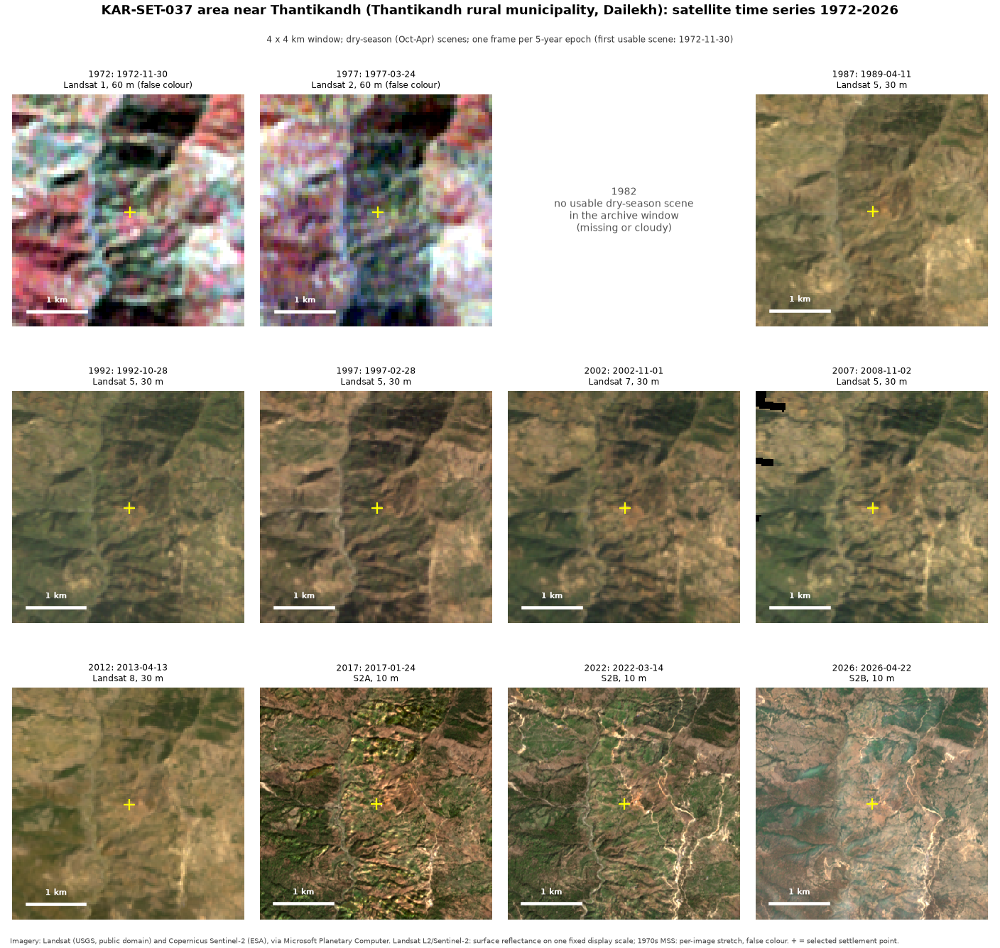
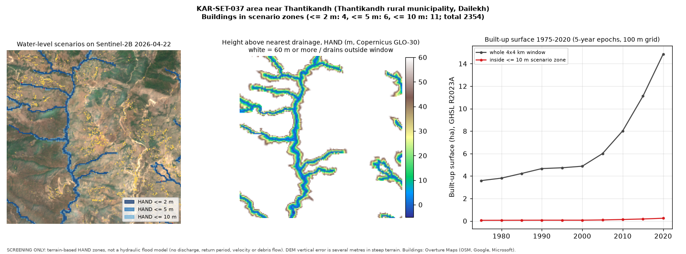

# KAR-SET-037: area near Thantikandh

*Generated 2026-10-02 by `analysis/hazard_exposure/compile_karnali_79.py` from the province-wide
screening run. All numbers are **derived** from the open datasets listed below; nothing here is a
field observation or a validated result. Sections marked "researcher input" are intentionally empty.*

## Identification

| Field | Value |
|---|---|
| Settlement ID | KAR-SET-037 |
| Name (display / primary script) | area near Thantikandh / Thantikandh |
| Local level | Thantikandh (rural municipality), P-code NP0661401 |
| District | Dailekh |
| Point (WGS 84) | 81.515853, 28.983825 |
| Selection method | `densest_building_cluster_nearest_name` (see docs/methodology.md) |
| Source record | Overture locality `8067c03f-23f0-4ae0-9f45-ec47ea514f56`; OSM `r11020318@6`; class `unknown` |

The point is the building-density-selected primary settlement of the local level, **not** an
officially designated headquarters. Confirm or correct it (researcher input).

## Geographic context

- Analysis window: 4 x 4 km centred on the point.
- Building footprints in window: 2,354 (OSM 1,696, Google 364, Microsoft 294; Overture de-duplicated).

## Nearby rivers / water bodies

- Nearest named mapped watercourse: **कर्णाली**, 7,531 m from the point.
- Nearest mapped river-class line: 3,306 m.
- Buildings within 100 m of a mapped river/stream: 229.
- Median HAND of buildings in window: 209.3 m.

## Historical imagery

| Epoch | Acquired | Platform | Resolution | Scene ID | Chip cloud/shadow/snow fraction |
|---|---|---|---|---|---|
| 1972 | 1972-11-30 | landsat-1 | 60 m | `LM01_L1TP_155040_19721130_02_T2` | 0.0 |
| 1977 | 1977-03-24 | landsat-2 | 60 m | `LM02_L1TP_155040_19770324_02_T2` | 0.0 |
| 1987 | 1989-04-11 | landsat-5 | 30 m | `LT05_L2SP_144040_19890411_02_T1` | 0.0 |
| 1992 | 1992-10-28 | landsat-5 | 30 m | `LT05_L2SP_144040_19921028_02_T1` | 0.0 |
| 1997 | 1997-02-28 | landsat-5 | 30 m | `LT05_L2SP_144040_19970228_02_T1` | 0.0 |
| 2002 | 2002-11-01 | landsat-7 | 30 m | `LE07_L2SP_144040_20021101_02_T1` | 0.0 |
| 2007 | 2008-11-02 | landsat-5 | 30 m | `LT05_L2SP_143040_20081102_02_T1` | 0.0 |
| 2012 | 2013-04-13 | landsat-8 | 30 m | `LC08_L2SP_144040_20130413_02_T1` | 0.0 |
| 2017 | 2017-01-24 | Sentinel-2A | 10 m | `S2A_MSIL2A_20170124T051101_R019_T44RNT_20210207T175513` | 0.0 |
| 2022 | 2022-03-14 | Sentinel-2B | 10 m | `S2B_MSIL2A_20220314T050649_R019_T44RNT_20220314T143917` | 0.0 |
| 2026 | 2026-04-22 | Sentinel-2B | 10 m | `S2B_MSIL2A_20260422T050649_R019_T44RNT_20260422T085212` | 0.0 |

Epochs without a row had no usable dry-season scene in the archive window.

## Observed transformation

**Derived (GHSL R2023A built-up surface, ha, 100 m grid):**

- Whole window: 1975: 3.6 | 1980: 3.8 | 1985: 4.2 | 1990: 4.7 | 1995: 4.7 | 2000: 4.9 | 2005: 6.0 | 2010: 8.0 | 2015: 11.1 | 2020: 14.9
- Inside the HAND <= 10 m zone: 1975: 0.1 | 1980: 0.1 | 1985: 0.1 | 1990: 0.1 | 1995: 0.1 | 2000: 0.1 | 2005: 0.1 | 2010: 0.1 | 2015: 0.2 | 2020: 0.2

**Visual observations from the image series:** researcher input. Record each in
`case_studies/.../metadata/observation_log.csv` style: image ID, feature, observed change, confidence.

## Hazard context (water-level scenarios)

| Scenario | Buildings in zone | Share of window buildings | Zone area in window (ha) |
|---|---|---|---|
| HAND <= 2 m | 4 | 0.2% | 61.2 |
| HAND <= 5 m | 6 | 0.3% | 71.1 |
| HAND <= 10 m | 11 | 0.5% | 93.7 |

Province rank by buildings with HAND <= 5 m: **65 of 79** (1 = most).

## Evidence

- Imagery: Landsat Collection 2 (USGS) and Sentinel-2 L2A (ESA Copernicus) via Microsoft Planetary Computer (scene IDs above; catalogued in `data/metadata/imagery_catalog.csv`).
- DEM: Copernicus GLO-30 (`Copernicus_DSM_COG_10_N29_00_E081_00_DEM;Copernicus_DSM_COG_10_N28_00_E081_00_DEM`).
- Channels, places, buildings: Overture Maps 2026-09-23.1.
- Built-up history: JRC GHS-BUILT-S R2023A.

## Interpretation

Researcher input. The derived numbers show where buildings sit on low ground relative to mapped
drainage; they do not by themselves establish flood probability, depth, or risk to life.

## Uncertainty

- HAND from a 30 m DEM: vertical error of several metres in steep terrain; narrow gorges and small
  channels are poorly resolved; unmapped streams are missing from the drainage network.
- Scenario zones are static terrain thresholds, not modelled floods: no discharge, return period,
  velocity, debris flow, landslide-dam outburst or bank erosion is represented.
- Building footprints combine OSM and ML-derived datasets of different dates; counts are not people.
- 1970s Landsat MSS (60 m, false colour) cannot resolve individual buildings; sensor, season and
  resolution differ between epochs.

## Follow-up analysis

- [ ] Confirm the settlement point and name with local knowledge.
- [ ] Record visual observations per epoch (river channel shifts, new construction on floodplain/fan).
- [ ] Check flood/debris-flow history for this location (e.g. DesInventar Nepal, BIPAD portal).
- [ ] If prioritised: higher-resolution DEM and a hydraulic model with design discharges.
