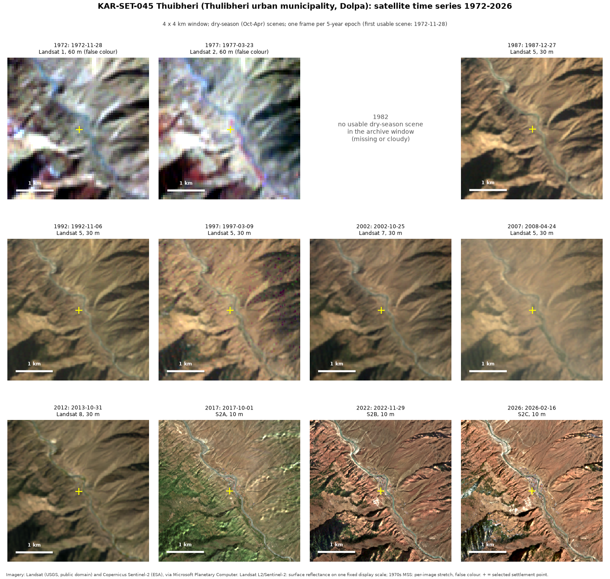
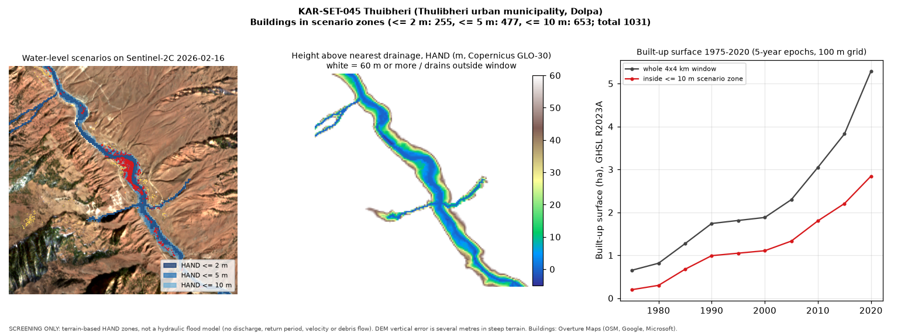

# KAR-SET-045: Thuibheri

*Generated 2026-10-02 by `analysis/hazard_exposure/compile_karnali_79.py` from the province-wide
screening run. All numbers are **derived** from the open datasets listed below; nothing here is a
field observation or a validated result. Sections marked "researcher input" are intentionally empty.*

## Identification

| Field | Value |
|---|---|
| Settlement ID | KAR-SET-045 |
| Name (display / primary script) | Thuibheri / Thuibheri |
| Local level | Thulibheri (urban municipality), P-code NP0662302 |
| District | Dolpa |
| Point (WGS 84) | 82.893491, 28.951978 |
| Selection method | `named_locality_max_buildings` (see docs/methodology.md) |
| Source record | Overture locality `d03f26b3-2c0e-43a0-8075-8ba87feb6d7d`; OSM `n9220894174@1`; class `town` |

The point is the building-density-selected primary settlement of the local level, **not** an
officially designated headquarters. Confirm or correct it (researcher input).

## Geographic context

- Analysis window: 4 x 4 km centred on the point.
- Building footprints in window: 1,031 (OSM 898, Google 69, Microsoft 64; Overture de-duplicated).

## Nearby rivers / water bodies

- Nearest named mapped watercourse: **Thuli Bheri**, 146 m from the point.
- Nearest mapped river-class line: 138 m.
- Buildings within 100 m of a mapped river/stream: 743.
- Median HAND of buildings in window: 6.1 m.

## Historical imagery

| Epoch | Acquired | Platform | Resolution | Scene ID | Chip cloud/shadow/snow fraction |
|---|---|---|---|---|---|
| 1972 | 1972-11-28 | landsat-1 | 60 m | `LM01_L1TP_153040_19721128_02_T2` | 0.0027 |
| 1977 | 1977-03-23 | landsat-2 | 60 m | `LM02_L1TP_154040_19770323_02_T2` | 0.0 |
| 1987 | 1987-12-27 | landsat-5 | 30 m | `LT05_L2SP_143040_19871227_02_T1` | 0.0004 |
| 1992 | 1992-11-06 | landsat-5 | 30 m | `LT05_L2SP_143040_19921106_02_T1` | 0.0 |
| 1997 | 1997-03-09 | landsat-5 | 30 m | `LT05_L2SP_143040_19970309_02_T1` | 0.0001 |
| 2002 | 2002-10-25 | landsat-7 | 30 m | `LE07_L2SP_143040_20021025_02_T1` | 0.0 |
| 2007 | 2008-04-24 | landsat-5 | 30 m | `LT05_L2SP_143040_20080424_02_T1` | 0.0 |
| 2012 | 2013-10-31 | landsat-8 | 30 m | `LC08_L2SP_143040_20131031_02_T1` | 0.0 |
| 2017 | 2017-10-01 | Sentinel-2A | 10 m | `S2A_MSIL2A_20171001T050651_R019_T44RPT_20210202T121726` | 0.0003 |
| 2022 | 2022-11-29 | Sentinel-2B | 10 m | `S2B_MSIL2A_20221129T051149_R019_T44RPT_20221130T153301` | 0.0 |
| 2026 | 2026-02-16 | Sentinel-2C | 10 m | `S2C_MSIL2A_20260216T050911_R019_T44RPT_20260216T100811` | 0.0 |

Epochs without a row had no usable dry-season scene in the archive window.

## Observed transformation

**Derived (GHSL R2023A built-up surface, ha, 100 m grid):**

- Whole window: 1975: 0.7 | 1980: 0.8 | 1985: 1.3 | 1990: 1.7 | 1995: 1.8 | 2000: 1.9 | 2005: 2.3 | 2010: 3.0 | 2015: 3.8 | 2020: 5.3
- Inside the HAND <= 10 m zone: 1975: 0.2 | 1980: 0.3 | 1985: 0.7 | 1990: 1.0 | 1995: 1.1 | 2000: 1.1 | 2005: 1.3 | 2010: 1.8 | 2015: 2.2 | 2020: 2.8

**Visual observations from the image series:** researcher input. Record each in
`case_studies/.../metadata/observation_log.csv` style: image ID, feature, observed change, confidence.

## Hazard context (water-level scenarios)

| Scenario | Buildings in zone | Share of window buildings | Zone area in window (ha) |
|---|---|---|---|
| HAND <= 2 m | 255 | 24.7% | 54.4 |
| HAND <= 5 m | 477 | 46.3% | 74.9 |
| HAND <= 10 m | 653 | 63.3% | 100.3 |

Province rank by buildings with HAND <= 5 m: **3 of 79** (1 = most).

## Evidence

- Imagery: Landsat Collection 2 (USGS) and Sentinel-2 L2A (ESA Copernicus) via Microsoft Planetary Computer (scene IDs above; catalogued in `data/metadata/imagery_catalog.csv`).
- DEM: Copernicus GLO-30 (`Copernicus_DSM_COG_10_N28_00_E082_00_DEM`).
- Channels, places, buildings: Overture Maps 2026-09-23.1.
- Built-up history: JRC GHS-BUILT-S R2023A.

## Interpretation

Researcher input. The derived numbers show where buildings sit on low ground relative to mapped
drainage; they do not by themselves establish flood probability, depth, or risk to life.

## Uncertainty

- HAND from a 30 m DEM: vertical error of several metres in steep terrain; narrow gorges and small
  channels are poorly resolved; unmapped streams are missing from the drainage network.
- Scenario zones are static terrain thresholds, not modelled floods: no discharge, return period,
  velocity, debris flow, landslide-dam outburst or bank erosion is represented.
- Building footprints combine OSM and ML-derived datasets of different dates; counts are not people.
- 1970s Landsat MSS (60 m, false colour) cannot resolve individual buildings; sensor, season and
  resolution differ between epochs.

## Follow-up analysis

- [ ] Confirm the settlement point and name with local knowledge.
- [ ] Record visual observations per epoch (river channel shifts, new construction on floodplain/fan).
- [ ] Check flood/debris-flow history for this location (e.g. DesInventar Nepal, BIPAD portal).
- [ ] If prioritised: higher-resolution DEM and a hydraulic model with design discharges.
