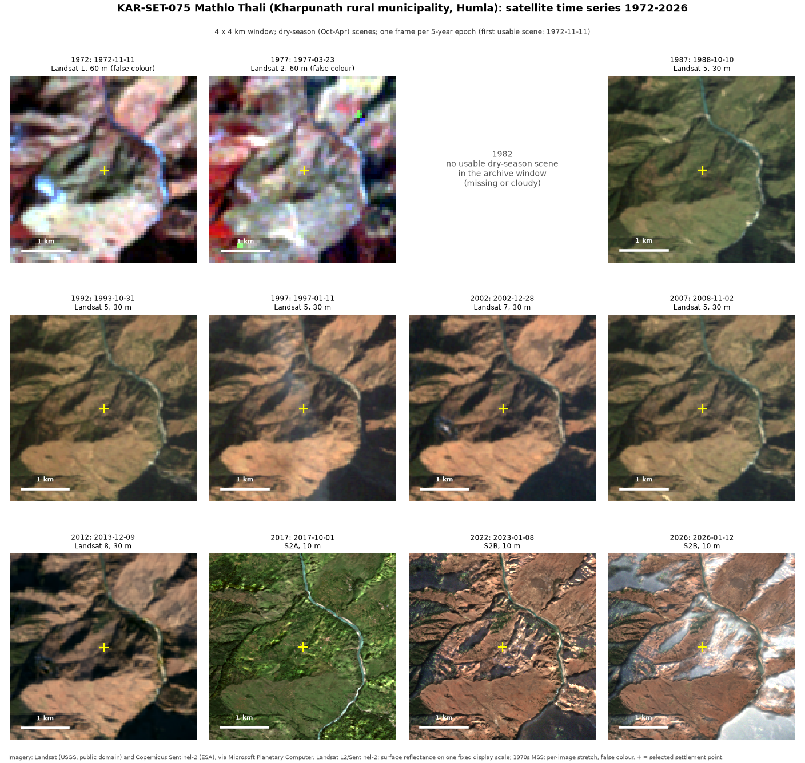
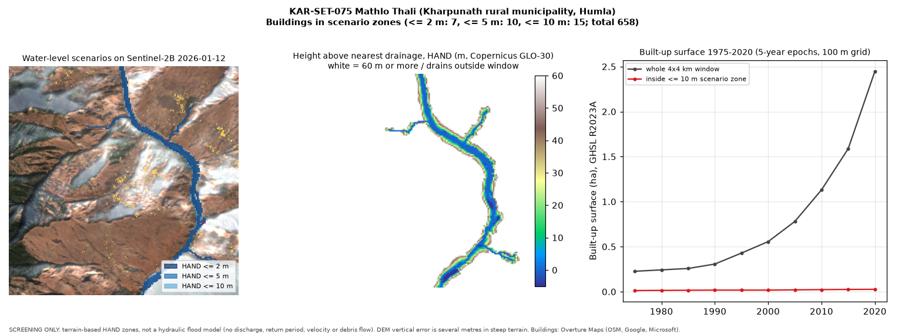

# KAR-SET-075: Mathlo Thali

*Generated 2026-10-02 by `analysis/hazard_exposure/compile_karnali_79.py` from the province-wide
screening run. All numbers are **derived** from the open datasets listed below; nothing here is a
field observation or a validated result. Sections marked "researcher input" are intentionally empty.*

## Identification

| Field | Value |
|---|---|
| Settlement ID | KAR-SET-075 |
| Name (display / primary script) | Mathlo Thali / Mathlo Thali |
| Local level | Kharpunath (rural municipality), P-code NP0666403 |
| District | Humla |
| Point (WGS 84) | 81.874535, 29.849594 |
| Selection method | `named_locality_max_buildings` (see docs/methodology.md) |
| Source record | Overture locality `a7f5abb9-7e62-48aa-802b-b938b9c5ac59`; OSM `n10814104098@1`; class `hamlet` |

The point is the building-density-selected primary settlement of the local level, **not** an
officially designated headquarters. Confirm or correct it (researcher input).

## Geographic context

- Analysis window: 4 x 4 km centred on the point.
- Building footprints in window: 658 (OSM 321, Google 319, Microsoft 18; Overture de-duplicated).

## Nearby rivers / water bodies

- Nearest named mapped watercourse: **कर्णाली**, 947 m from the point.
- Nearest mapped river-class line: 928 m.
- Buildings within 100 m of a mapped river/stream: 55.
- Median HAND of buildings in window: 415.6 m.

## Historical imagery

| Epoch | Acquired | Platform | Resolution | Scene ID | Chip cloud/shadow/snow fraction |
|---|---|---|---|---|---|
| 1972 | 1972-11-11 | landsat-1 | 60 m | `LM01_L1TP_154039_19721111_02_T2` | 0.0 |
| 1977 | 1977-03-23 | landsat-2 | 60 m | `LM02_L1TP_154039_19770323_02_T2` | 0.0 |
| 1987 | 1988-10-10 | landsat-5 | 30 m | `LT05_L2SP_143039_19881010_02_T1` | 0.0 |
| 1992 | 1993-10-31 | landsat-5 | 30 m | `LT05_L2SP_144039_19931031_02_T1` | 0.0 |
| 1997 | 1997-01-11 | landsat-5 | 30 m | `LT05_L2SP_144039_19970111_02_T1` | 0.0 |
| 2002 | 2002-12-28 | landsat-7 | 30 m | `LE07_L2SP_143039_20021228_02_T1` | 0.0005 |
| 2007 | 2008-11-02 | landsat-5 | 30 m | `LT05_L2SP_143039_20081102_02_T1` | 0.0 |
| 2012 | 2013-12-09 | landsat-8 | 30 m | `LC08_L2SP_144039_20131209_02_T1` | 0.0 |
| 2017 | 2017-10-01 | Sentinel-2A | 10 m | `S2A_MSIL2A_20171001T050651_R019_T44RNU_20210202T121734` | 0.0003 |
| 2022 | 2023-01-08 | Sentinel-2B | 10 m | `S2B_MSIL2A_20230108T051209_R019_T44RNU_20230108T174623` | 0.0 |
| 2026 | 2026-01-12 | Sentinel-2B | 10 m | `S2B_MSIL2A_20260112T051059_R019_T44RNU_20260112T073848` | 0.0 |

Epochs without a row had no usable dry-season scene in the archive window.

## Observed transformation

**Derived (GHSL R2023A built-up surface, ha, 100 m grid):**

- Whole window: 1975: 0.2 | 1980: 0.2 | 1985: 0.3 | 1990: 0.3 | 1995: 0.4 | 2000: 0.6 | 2005: 0.8 | 2010: 1.1 | 2015: 1.6 | 2020: 2.5
- Inside the HAND <= 10 m zone: 1975: 0.0 | 1980: 0.0 | 1985: 0.0 | 1990: 0.0 | 1995: 0.0 | 2000: 0.0 | 2005: 0.0 | 2010: 0.0 | 2015: 0.0 | 2020: 0.0

**Visual observations from the image series:** researcher input. Record each in
`case_studies/.../metadata/observation_log.csv` style: image ID, feature, observed change, confidence.

## Hazard context (water-level scenarios)

| Scenario | Buildings in zone | Share of window buildings | Zone area in window (ha) |
|---|---|---|---|
| HAND <= 2 m | 7 | 1.1% | 52.8 |
| HAND <= 5 m | 10 | 1.5% | 56.2 |
| HAND <= 10 m | 15 | 2.3% | 63.7 |

Province rank by buildings with HAND <= 5 m: **58 of 79** (1 = most).

## Evidence

- Imagery: Landsat Collection 2 (USGS) and Sentinel-2 L2A (ESA Copernicus) via Microsoft Planetary Computer (scene IDs above; catalogued in `data/metadata/imagery_catalog.csv`).
- DEM: Copernicus GLO-30 (`Copernicus_DSM_COG_10_N29_00_E081_00_DEM`).
- Channels, places, buildings: Overture Maps 2026-09-23.1.
- Built-up history: JRC GHS-BUILT-S R2023A.

## Interpretation

Researcher input. The derived numbers show where buildings sit on low ground relative to mapped
drainage; they do not by themselves establish flood probability, depth, or risk to life.

## Uncertainty

- HAND from a 30 m DEM: vertical error of several metres in steep terrain; narrow gorges and small
  channels are poorly resolved; unmapped streams are missing from the drainage network.
- Scenario zones are static terrain thresholds, not modelled floods: no discharge, return period,
  velocity, debris flow, landslide-dam outburst or bank erosion is represented.
- Building footprints combine OSM and ML-derived datasets of different dates; counts are not people.
- 1970s Landsat MSS (60 m, false colour) cannot resolve individual buildings; sensor, season and
  resolution differ between epochs.

## Follow-up analysis

- [ ] Confirm the settlement point and name with local knowledge.
- [ ] Record visual observations per epoch (river channel shifts, new construction on floodplain/fan).
- [ ] Check flood/debris-flow history for this location (e.g. DesInventar Nepal, BIPAD portal).
- [ ] If prioritised: higher-resolution DEM and a hydraulic model with design discharges.
